# 破解某验三代滑动验证码

> 本项目仅用作学习研究，严禁商业用途！
>
> 若本项目侵害了贵公司的权益，请及时联系我做相应处理。
>
> 本案例用的官网滑块，2021-8-26可用，相关js版本：`fullpage.9.0.7.js`  `slide.7.8.3.js`

## 破解流程

首先上一个滑动验证码通用的一个破解流程：

**获取验证码图片 -> 获取缺口距离 -> 生成轨迹并加密提交**

某验三代滑动验证也是同样的流程，只不过每个小流程下面细分步骤相对比较多，

先说一下大致的一个过程：

- 获取验证码图片
  - 请求register接口，拿到gt和challenge
  - 利用`fullpage.9.0.7.js`生成第一个加密参数w
  - 带上gt、challenge、w（第一个）请求get.php接口，返回json格式的配置信息，并取出json里的s值
  - 利用s值和`fullpage.9.0.7.js`生成第二个加密参数w（避坑：这里用到了AES加密，密钥需要和生成第一个w的AES密钥保持一致）
  - 带上gt、challenge、w（第二个）请求ajax.php接口，返回验证码类型（slide）则为成功
  - 带上gt、challeng再次请求get.php接口，返回json格式的验证码图片信息。（包含背景图、缺口背景图），从json中取出s、c、challenge值备用。
  - 下载验证码图片（该图片是打乱的，需要做还原处理）

- 获取缺口距离
  - 验证码图片还原（还原逻辑在`slide.7.8.3.js`中，本案例用python复写）
  - 利用背景图及缺口背景图的像素差对比找出缺口距离（网上很多教程，注意自己测试调整阈值）
  - 计算真实的缺口距离（上一步结果直接减6，用PS量出来的(*^__^*) ）
- 生成轨迹并加密提交
  - 先建一个轨迹库（至于为什么不用轨迹生成算法，因为网上的大多不太靠谱，自己又不会写(ㄒoㄒ)，轨迹库500条就够用）
  - 根据缺口距离从轨迹库中匹配一条轨迹
  - 利用匹配出的轨迹列表、s、c、challenge（特意红色标注，这个challenge是个坑，一定要用新的值）和`slide.7.8.3.js`生成第三个加密参数w
  - 带上challenge、w（第三个）再次请求ajax.php接口，获取验证结果

也可以从代码方面看一下主逻辑：

### 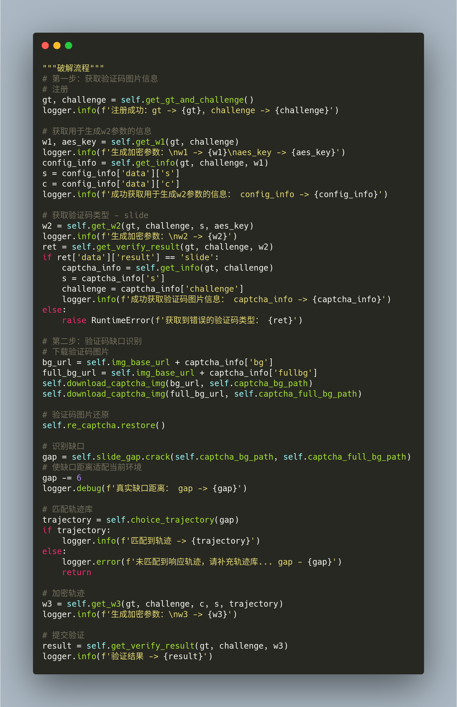

 

贴一张图纪念一下O(∩_∩)O

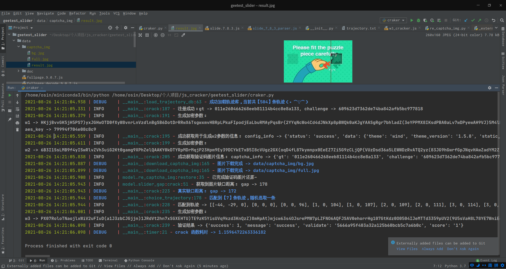

好了，接下来稍微详细点讲讲整个破解分析的过程（花了我两天时间不记录一下血亏╭(╯^╰)╮）

 

### 第一步：获取验证码图片

#### 破解第一个w加密参数

首先，要拿到gt和challenge值，这个没什么好说的，直接请求获取

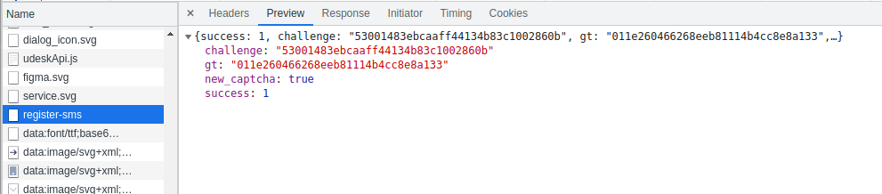

 

接着需要获取一个关键参数——s

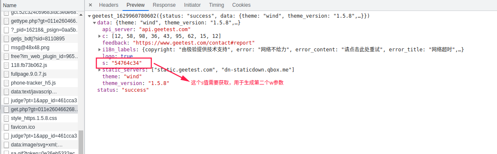

 

看看请求体

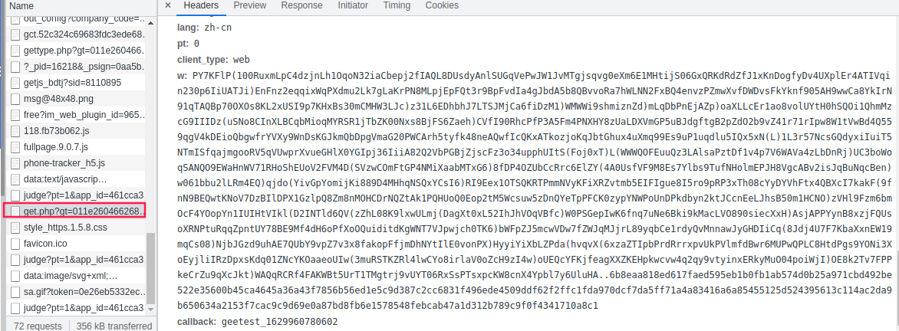

好家伙，有个加密的w参数（这是第一个加密的w参数）

 

打开堆栈，随便跟进一个函数看看：

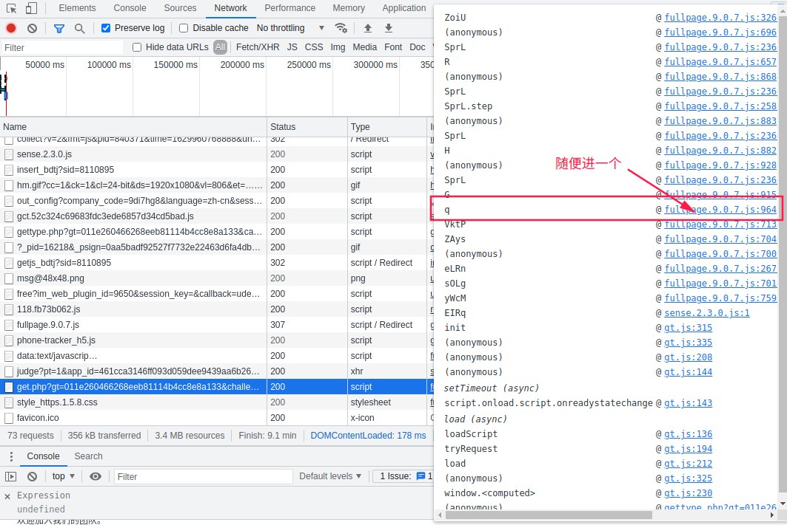

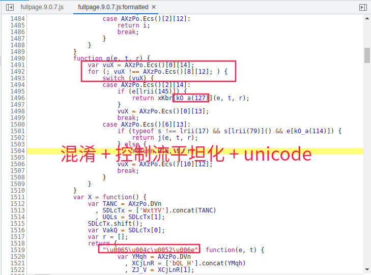

某验的js代码里全是这种混淆代码，十分影响调试，最好能先还原一下，这里推荐一篇针对性的文章：https://mp.weixin.qq.com/s?__biz=MzU2NjQ2NzMyNw==&mid=2247488294&idx=1&sn=7740315267b2fed9299edd417aeb6bab&chksm=fcad5cb6cbdad5a03dd99ba327d35386add22d59b2957944c99fc16ca98d207204e92d8c3826&scene=21#wechat_redirect

 

对js代码还原后可以利用工具以本地文件代理网页请求，我用的是Reres插件

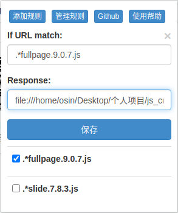

 

再来看看效果

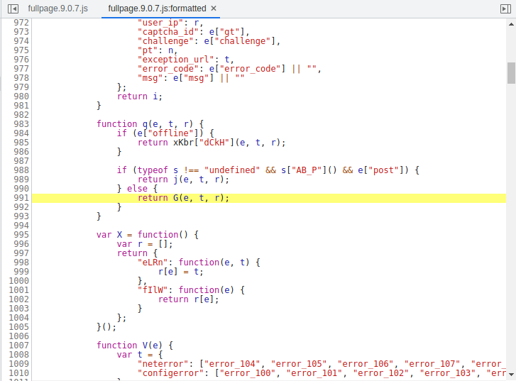

 

嗯，清晰多了，直接搜索关键字"w"（小技巧：带着引号搜索），发现有两个比较像的地方：

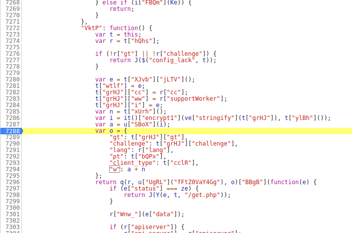

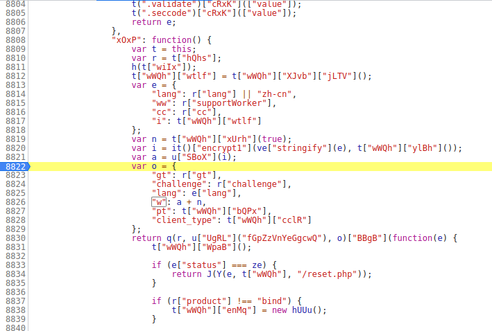

 

打上断点，刷新网页，发现第一个断点卡住了。ok，这里我们确定了w参数的加密入口，w是由a参数和n参数拼接而成的，a参数生成又需要i参数。

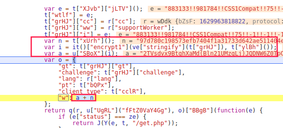

 

入口找到了，然后就是蛋疼的扣代码时间，先看看n参数的生成，追进Q方法里一顿跟踪会发现它就是一个RSA加密，加密的东西是一段随机生成的字符串。这里就提前说结论了，这段随机生成的字符串就是后面AES加密的密钥

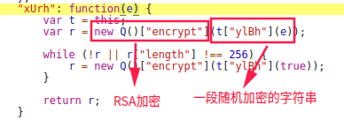

 

接着看i参数，加密方法是it()下面的encrypt1方法：

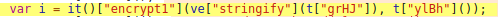

 

追进it()，可以看到很多AES加密特征：

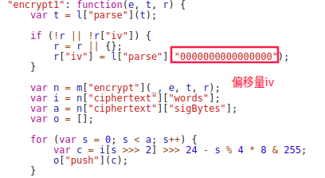

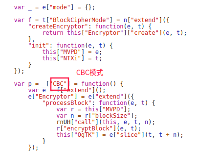

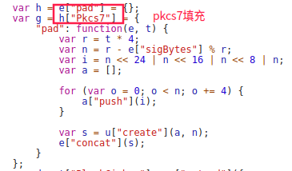

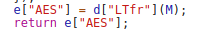

虽然已经知道了AES加密必须的data、key、iv、mode、pad，但仍然无法用python复写加密，因为某验的AES加密后面是有数组移位的，只能老实扣代码，好在直接将it()函数拿下来就能用。

这里它加密的是一个Config对象，需要自己构建一下，里面的参数大多数不会变，注意下**Config['i']**，这个参数里面有个时间戳，需要用`new Date().getTime()`生成一下。密钥的话就是之前RSA加密的那个：

 

得到参数i之后，可以看到它是一个加密完成的大数组，还需要将它还原成字符串，也就是参数a。用的魔改的base64编码，同样需要扣。

这里建议直接把变量u扣下来（我们的加密函数“VktP”也在变量u里）

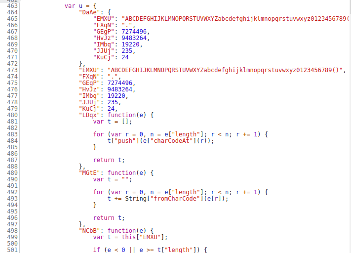

接下来缺啥补啥，也需要补环境变量，顺利的话第一个w就能出来了- -记得这里把生成的AES密钥留下，加密第二个w的时候要用。

 

#### 破解第二个w加密参数

有了第一个w参数，我们就可以去请求get.php接口了，然后会得到一些信息

 

接下来我们触发验证码，看看抓包：

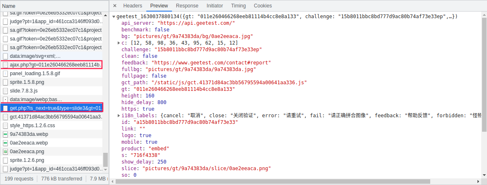

可以看到又请求了一次get.php接口，并且返回了验证码图片的相关信息。但是在此之前，需要先请求一下ajax.php接口（需要第二个w加密参数）

 

好了，我们之前不是发现了两个"w"生成的地方了吗，都打上了断点。但是验证码都出来了却并没有断到，What？

先不要慌，可以从调用堆去一步步调试，然后找出入口，由于比较费时，这里就不找了。追堆栈的话最后会发现在`sOLg`对象里面有我们需要的w（名字是‘PTyY’）。这里我们直接搜索"encrypt"定位到加密位置，就是这里了没错：

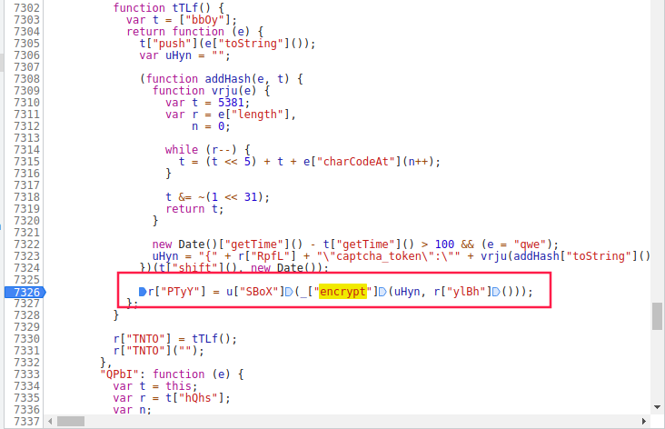

 

刷新网页，再次触发验证码，发现断到了。我们看看加密需要的东西：

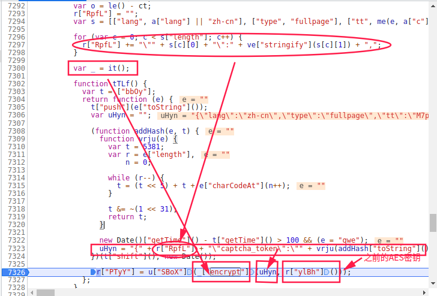

可以看到加密函数还是之前的it()，待加密的文本的生成还需要用到tTLf()函数外的东西，所以扣代码最好从外层函数扣。这是个折磨人的过程，其中也检测了很多浏览器特征，慢慢补吧，这里就不细说了，基本功不够就多练练（本人也很菜，失败了几次，又重新扣，时间大部分浪费在这了/(ㄒoㄒ)/）

 

贴一下需要补的浏览器环境

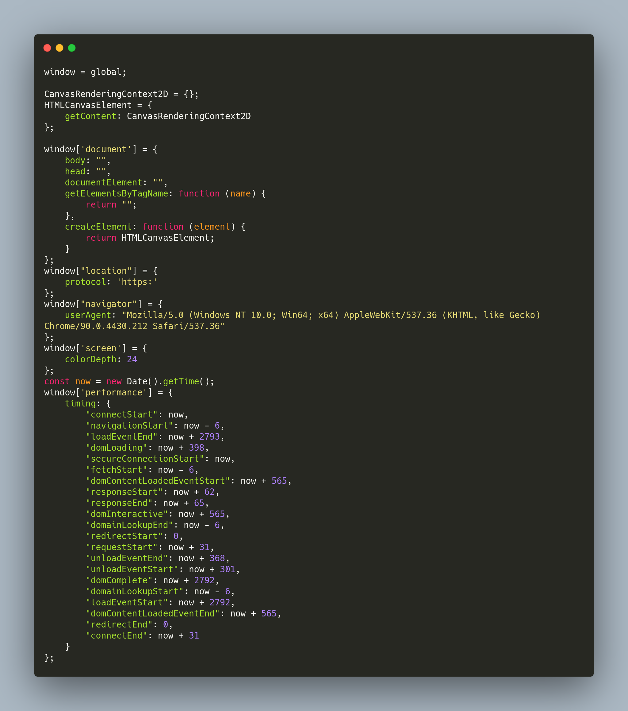

对了，canvas指纹检测那块的话，直接把返回结果写死就好，我也忘了是第一个w还是第二个w生成需要检测了（小声哔哔。。。）

 

#### 获取图片验证码

ok，拿到了第二个w参数之后，我们带上它请求一下ajax.php接口，可以看到返回类型为“slide”，那就说明第二个w参数有效

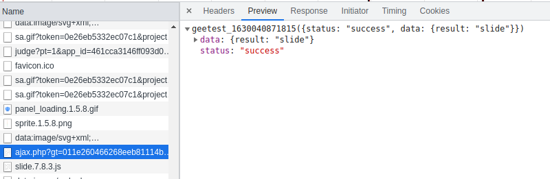

 

接着用gt和challenge值请求一下get.php接口（不需要w参数），就可以看到有验证码信息返回了

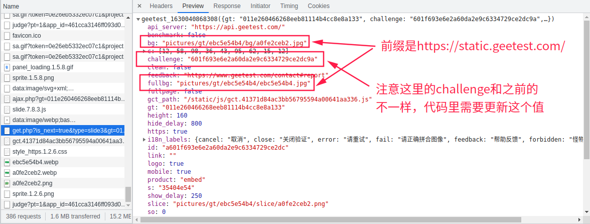

 

使用拼接好的url下载验证码图片保存到本地（没啥坑）。坑就坑在这个返回的challenge，比之前的值后面多了两字符，害我后面调试了一早上（吐槽一下）

好了，这一部分到这里就结束了。

 

### 第二步：识别验证码图片缺口距离

